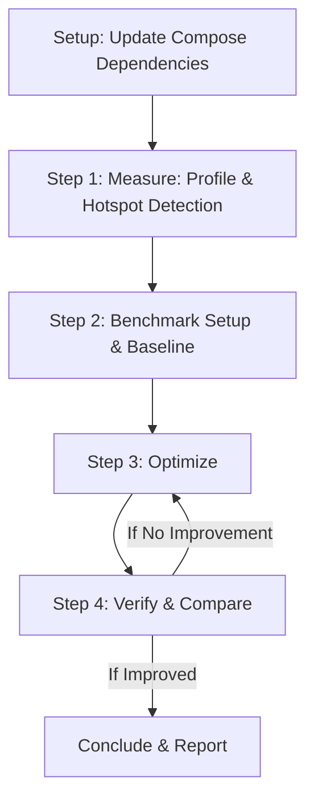

# Performance Measurement & Optimization Loop

Use this skill to systematically diagnose, benchmark, optimize, and verify UI performance (jank, startup, rendering, and Compose recompositions).

This skill MUST be executed as a **fully automated step-by-step loop**. Automatically proceed from one step to the next without pausing to ask the user for confirmation.

---

## The Optimization Loop Flow



---

## Setup & Prerequisites

Before beginning the optimization loop:
1. **Target Physical Devices**: Prioritize connected physical devices (e.g. Pixel devices) over Android emulators for all profiling, trace capture, and macrobenchmarking to ensure real-world hardware rendering and CPU performance characteristics.
2. **Update Compose Dependencies**: Inspect `gradle/libs.versions.toml` (or equivalent version catalogs / `versions.properties`) and update Jetpack Compose dependencies (Compose BOM, compiler, runtime, and UI libraries) to their latest stable versions. Many performance fixes and runtime optimizations are provided automatically in newer Compose releases.
3. **Disable Development Interference**: Ensure LeakCanary or other development tools are disabled or removed from profiling builds.
4. **Verify or Create Benchmark Module**: Check if the project contains a `:benchmark` or `:baselineprofile` module. If missing, **YOU MUST IMMEDIATELY CREATE ONE** using the **`benchmark-helper`** skill before proceeding to benchmark capture.

---

## Step 1. Profile & Hotspot Detection

1. **Disable Development Interference**: Ensure the app is built in a release-like profileable mode.
2. **Profile**: Apply the **`perfetto-hotspots`** skill to capture a Perfetto trace of the target user journey.
3. **Analyze**: Identify the main rendering or composition bottlenecks (e.g. long frame times, JIT compilation, or specific Composables taking too long).
4. **Proceed**: Log the identified hotspots and automatically proceed directly to Step 2 (Benchmark Setup & Baseline).

---

## Step 2. Benchmark Setup & Baseline

1. **Check & Create Benchmark Module**:
   - Check `settings.gradle` / `settings.gradle.kts` for a `:benchmark` or `:baselineprofile` module.
   - If missing, apply the **`benchmark-helper`** skill to:
     - Create a `:benchmark` module with `com.android.test` plugin.
     - Add `:benchmark` to `settings.gradle`.
     - Configure `:app` with a non-debuggable, profileable `benchmark` build type (`isDebuggable = false`).
2. **Mandatory Benchmark Test Suite Setup**:
   - **Startup Benchmarks**: Create a cold and warm startup benchmark class (e.g., `StartupBenchmark.kt`) using `MacrobenchmarkRule` with `StartupTimingMetric()` testing both `CompilationMode.None` (uncompiled) and `CompilationMode.Partial` (with Baseline Profile).
   - **Baseline Profile Generator**: Create a `BaselineProfileGenerator.kt` test using `BaselineProfileRule` to capture critical user journeys (app launch, main navigation, scrolling key lists).
   - **CUJ Frame Timing Benchmarks**: Create UI benchmarks (e.g. `ScrollBenchmark.kt`) using `FrameTimingMetric()` and composition tracing for targeted screens.
3. **Execute Gradle Benchmarks & Capture Baseline**:
   - Execute the actual Gradle test runner on the target physical device or emulator:
     ```bash
     ./gradlew :benchmark:connectedBenchmarkBenchmarkAndroidTest \
       -P android.testInstrumentationRunnerArguments.class=<package_name>.StartupBenchmark
     ```
   - **Important**: NEVER generate theoretical or dummy numbers. Always run real Gradle benchmark commands and extract metrics from the output or Perfetto traces.
4. **Archive**: Save raw text output and `.perfetto-trace` files to `benchmark_reports/baseline/`.
5. **Proceed**: Log the archived baseline metrics (Startup time P50/P90, Frame durations) and automatically proceed directly to Step 3 (Optimize).

---

## Step 3. Optimize

1. **Apply Optimizations**: Use the **`compose-performance`** skill to optimize target code (e.g., stabilizing parameters, deferring state reads, optimizing lazy layouts).
2. **Generate / Update Baseline Profiles**: Run the Baseline Profile generator task (`./gradlew :app:generateBaselineProfile` or running `BaselineProfileGenerator` via macrobenchmark) to produce updated `baseline-prof.txt` rules and embed them into the app.
3. **Proceed**: Explain the code changes and their theoretical performance impact, and automatically proceed directly to Step 4 (Verify & Compare).

---

## Step 4. Verify & Compare

1. **Rerun Benchmarks**: Execute the same startup and frame timing macrobenchmarks under identical conditions.
2. **Archive Optimized Results**: Save new text results and `.perfetto-trace` files to `benchmark_reports/optimized/`.
3. **Compare**: Compare the metrics between `benchmark_reports/baseline/` and `benchmark_reports/optimized/`:
   - Startup time improvement (`StartupTimingMetric` with `CompilationMode.None` vs `CompilationMode.Partial`).
   - Frame durations (P50, P90, P95, P99) and frame overruns.
   - Composition section counts/durations (`TraceSectionMetric`).
4. **Decision Gate**:
   - **If Improved**: Generate the final optimization report using the format in [optimization_report_template.md](file://./templates/optimization_report_template.md), including a Prerequisites & Application Audit Checklist with check (`✅`) and cross (`❌`) emojis for Compose dependency versions, Baseline Profile configuration, R8 minification, and diagnostic interference checks.
   - **If NOT Improved**: Undo the changes, document the failure in a scratchpad, and loop back to Step 3 with a different optimization hypothesis.
5. **Conclude**: Present the final report, comparison table, and status to the user.

