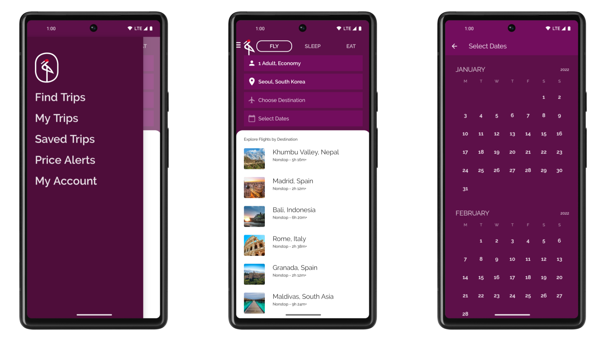

# Crane sample

[Crane](https://material.io/design/material-studies/crane.html) is a travel app part of the Material
Studies built with [Jetpack Compose](https://developer.android.com/jetpack/compose).
The goal of the sample is to showcase Material components, draggable UI elements, Android Views
inside Compose, and UI state handling.

To try out this sample app, use the latest stable version
of [Android Studio](https://developer.android.com/studio).
You can clone this repository or import the
project from Android Studio following the steps
[here](https://developer.android.com/jetpack/compose/setup#sample).

## Screenshots



## Features

This sample contains 4 screens:
- __Landing__ [screen][landing] that fades out after 2 seconds then slides the main content in from
the bottom of the screen.
- __Home__ [screen][home] where you can explore flights, hotels, and restaurants specifying
the number of people.
 - Clicking on the number of people refreshes the destinations.
 - Destination's images are retrieved using the [coil-accompanist][coil-accompanist] library.
- __Calendar__ [screen][calendar]. Tapping on __Select Dates__ takes you to a calendar built
completely from scratch. It makes a heavy usage of Compose's state APIs.
- Destination's __Details__ [screen][details]. When tapping on a destination, a new screen
implemented using a different Activity will be displayed. In there, you can see the a `MapView`
embedded in Compose and Compose buttons updating the Android View. Notice how you can also
interact with the `MapView` seamlessly.

Crane is a multi-activity app that showcases how navigating between activities can be done in
Jetpack Compose.

## Hilt

Crane uses [Hilt][hilt] to manage its dependencies. Hilt's ViewModel (with the
`@HiltViewModel` annotation) works perfectly with Compose's ViewModel integration (`viewModel()`
composable function) as you can see in the following snippet of code. `viewModel()` will
automatically use the factory that Hilt creates for the ViewModel:

```
@HiltViewModel
class MainViewModel @Inject constructor(
    private val destinationsRepository: DestinationsRepository,
    @DefaultDispatcher private val defaultDispatcher: CoroutineDispatcher,
    datesRepository: DatesRepository
) : ViewModel() { ... }

@Composable
fun CraneHomeContent(
    viewModel: MainViewModel = viewModel()
) {
    ...
}
```

Disclaimer: Passing dependencies to a ViewModel which are not available at compile time (which is
sometimes called _assisted injection_) doesn't work as you might expect using `viewModel()`.
Compose's ViewModel integration cannot currently scope a ViewModel to a given composable. Instead
it is always scoped to the host Activity or Fragment. This means that calling `viewModel()` with
different factories in the same host Activity/Fragment don't have the desired effect; the _first_
factory will be always used.

This is the case of the [DetailsViewModel](/app/src/main/java/androidx/compose/samples/crane/details/DetailsViewModel.kt), which takes the name of
a `City` as a parameter to load the required information for the screen. However, the above isn't a
problem in this sample, since `DetailsScreen` is always used in it's own newly launched Activity.

## Google Maps SDK

To get the MapView working, you need to get an API key as
the [documentation says](https://developers.google.com/maps/documentation/android-sdk/get-api-key),
and include it in the `local.properties` file as follows:

```
MAPS_API_KEY=insert_your_api_key_here
```

When restricting the Key to Android apps, use `androidx.compose.samples.crane` as package name, and
`A0:BD:B3:B6:F0:C4:BE:90:C6:9D:5F:4C:1D:F0:90:80:7F:D7:FE:1F` as SHA-1 certificate fingerprint.

## Images

Image resources are retrieved from [Unsplash](https://unsplash.com/).

## Testing

Crane has Compose-only tests (e.g. [HomeTest][homeTest]) but also tests covering Compose and the
view-based system (e.g. [DetailsActivityTest][detailsTest]). The latter uses the `onActivity`
method of the `ActivityScenarioRule` to access information from the `MapView`.

## License

```
Copyright 2020 The Android Open Source Project

Licensed under the Apache License, Version 2.0 (the "License");
you may not use this file except in compliance with the License.
You may obtain a copy of the License at

    https://www.apache.org/licenses/LICENSE-2.0

Unless required by applicable law or agreed to in writing, software
distributed under the License is distributed on an "AS IS" BASIS,
WITHOUT WARRANTIES OR CONDITIONS OF ANY KIND, either express or implied.
See the License for the specific language governing permissions and
limitations under the License.
```

[landing]: app/src/main/java/androidx/compose/samples/crane/home/LandingScreen.kt
[home]: app/src/main/java/androidx/compose/samples/crane/home/CraneHome.kt
[calendar]: app/src/main/java/androidx/compose/samples/crane/calendar/Calendar.kt
[details]: app/src/main/java/androidx/compose/samples/crane/details/DetailsActivity.kt
[mainViewModel]: app/src/main/java/androidx/compose/samples/crane/home/MainViewModel.kt
[detailsViewModel]: app/src/main/java/androidx/compose/samples/crane/details/DetailsViewModel.kt
[homeTest]: app/src/androidTest/java/androidx/compose/samples/crane/home/HomeTest.kt
[detailsTest]: app/src/androidTest/java/androidx/compose/samples/crane/details/DetailsActivityTest.kt
[coil-accompanist]: https://google.github.io/accompanist/coil/
[hilt]: https://d.android.com/hilt
