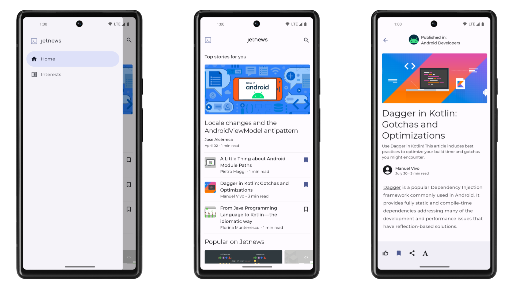
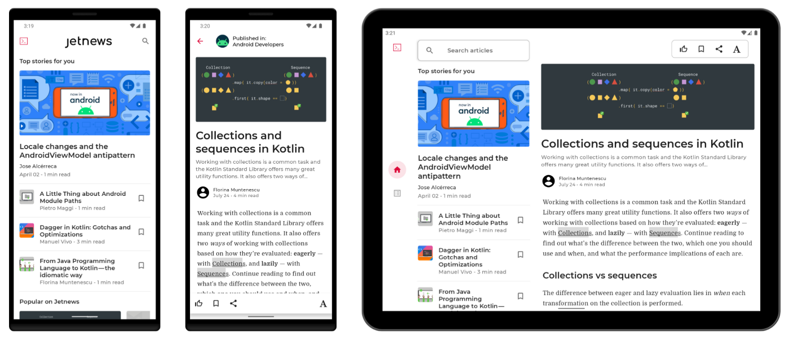

# Jetnews sample
Jetnews is a sample news reading app, built with
[Jetpack Compose](https://developer.android.com/jetpack/compose). The goal of the sample is to
showcase the current UI capabilities of Compose.

To try out this sample app, use the latest stable version
of [Android Studio](https://developer.android.com/studio).
You can clone this repository or import the
project from Android Studio following the steps
[here](https://developer.android.com/jetpack/compose/setup#sample).

## Screenshots



## Features

This sample contains three screens: a list of articles, a detail page for articles, and a page to
subscribe to topics of interest. The navigation from the the list of articles to the interests
screen uses a navigation drawer.

### App scaffolding

Package [`com.example.jetnews.ui`][1]

[`JetnewsApp.kt`][2] arranges the different screens in the `NavDrawerLayout`. 

[`JetnewsNavGraph.kt`][3] configures the navigation routes and actions in the app. 

[1]: app/src/main/java/com/example/jetnews/ui
[2]: app/src/main/java/com/example/jetnews/ui/JetnewsApp.kt
[3]: app/src/main/java/com/example/jetnews/ui/JetnewsNavGraph.kt

### Main article list

Package [`com.example.jetnews.ui.home`][4]

This screen shows how to create different custom Composable functions and combine them in a list
that scrolls vertically and horizontally.

See how to:

* Use `Row`s and `Column`s to arrange the contents of the UI
* Add a top app bar that elevates as the user scrolls
* Use Material's `Typography` and `ColorScheme` to style the text
* Use tonal elevation to make the `Card`s stand out from the background

[4]: app/src/main/java/com/example/jetnews/ui/home

### Article detail

Package [`com.example.jetnews.ui.article`][5]

This screen dives into the Text API, showing how to use different fonts than the ones defined in
[`Typography`][6]. It also adds a bottom app bar, with custom actions.

[5]: app/src/main/java/com/example/jetnews/ui/article
[6]: app/src/main/java/com/example/jetnews/ui/theme/Type.kt

### Interests screen

Package [`com.example.jetnews.ui.interests`][7]

This screens shows how to use Tabs and switch content depending on the selected tab. It
also includes a custom checkbox button, [SelectTopicButton][8]
that uses a `Toggleable` composable function to provide
the on/off behaviour and semantics, while drawing a custom UI. The UI of the button is partly
drawn with low-level primitives and partly overlaying images. See also how to visualize
on and off, light and dark version in the Android Studio Preview.

[7]: app/src/main/java/com/example/jetnews/ui/interests
[8]: app/src/main/java/com/example/jetnews/ui/interests/SelectTopicButton.kt

### AppWidget powered by Glance

Package [`com.example.jetnews.glance`][9]

This package shows how to use Glance and write compose style code for AppWidgets.

See how to:
* Use `Row`, `Column`, `LazyColumn` to arrange the contents of the UI
* Use a repository from your existing app to load data for the widget and perform updates
* Configure `android:updatePeriodMillis` to periodically refresh the widget
* Use `androidx.glance:glance-material3` library to create a custom color scheme with `GlanceTheme`
and use dynamic colors when supported
* Tint `Image`s to match the color scheme
* Launch an activity on click using `actionStartActivity`

[9]: app/src/main/java/com/example/jetnews/glance

### Data

The data in the sample is static, held in the `com.example.jetnews.data` package.

### Instrumented and Robolectric tests

UI tests can be run on device/emulators or on JVM with Robolectric.

* To run Instrumented tests use the "Instrumented tests" run configuration or run the `./gradlew connectedCheck` command.
* To run tests with Robolectric use the "Robolectric tests" run configuration or run the `./gradlew testDebug` command.

## Jetnews for every screen



We recently updated Jetnews to enhance its behavior across all mobile devices, both big and small.
Jetnews already had support for “traditional” mobile screens, so it was tempting to describe all of
our changes as “adding large screen support.” While that is true, it misses the point of having
adaptive UI. For example, if your app is running in split screen mode on a tablet, it shouldn't try
to display “tablet UI” unless it actually has enough space for it. With all of these changes,
Jetnews is working better than ever on large screens, but also on small screens too.

Check out the blog post that explains all the changes in more details:
https://medium.com/androiddevelopers/jetnews-for-every-screen-4d8e7927752

## License

```
Copyright 2021 The Android Open Source Project

Licensed under the Apache License, Version 2.0 (the "License");
you may not use this file except in compliance with the License.
You may obtain a copy of the License at

    https://www.apache.org/licenses/LICENSE-2.0

Unless required by applicable law or agreed to in writing, software
distributed under the License is distributed on an "AS IS" BASIS,
WITHOUT WARRANTIES OR CONDITIONS OF ANY KIND, either express or implied.
See the License for the specific language governing permissions and
limitations under the License.
```
