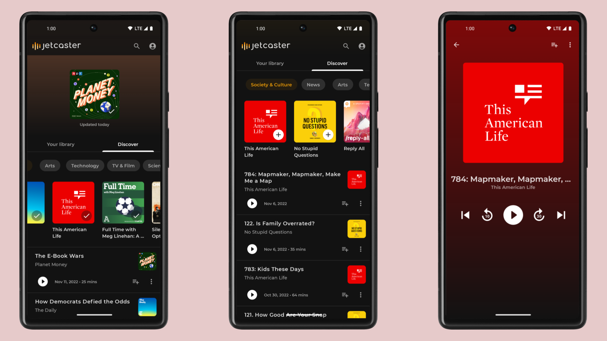
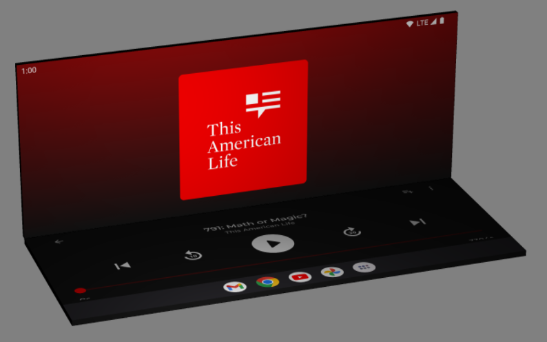

# Jetcaster sample 🎙️

Jetcaster is a sample podcast app, built with [Jetpack Compose][compose]. The goal of the sample is to
showcase dynamic theming and full featured architecture.

To try out this sample app, use the latest stable version
of [Android Studio](https://developer.android.com/studio).
You can clone this repository or import the
project from Android Studio following the steps
[here](https://developer.android.com/jetpack/compose/setup#sample).

### Status: 🚧 In progress 🚧

Jetcaster is still in the early stages of development, and as such only one screen has been created so far. However,
most of the app's architecture has been implemented, as well as the data layer, and early stages of dynamic theming.


## Screenshots



## Features

This sample contains 2 screens so far: the home screen, and a player screen.

The home screen is split into sub-screens for easy re-use:

- __Home__, allowing the user to see their followed podcasts (top carousel), and navigate between 'Your Library' and 'Discover'
- __Discover__, allowing the user to browse podcast categories
- __Podcast Category__, allowing the user to see a list of recent episodes for podcasts in a given category.

The player screen displays media controls and the currently "playing" podcast (the sample currently doesn't actually play any media).
The player screen layout is adapting to different form factors, including a tabletop layout on foldable devices:



### Dynamic theming
The home screen currently implements dynamic theming, using the artwork of the currently selected podcast from the carousel to  update the  `primary` and `onPrimary` [colors](https://developer.android.com/reference/kotlin/androidx/compose/material/Colors). You can see it in action in the screenshots above: as the carousel item is changed, the background gradient is updated to match the artwork.

This is implemented in [`DynamicTheming.kt`](app/src/main/java/com/example/jetcaster/util/DynamicTheming.kt), which provides the `DynamicThemePrimaryColorsFromImage` composable, to automatically animate the theme colors based on the provided image URL, like so:

``` kotlin
val dominantColorState: DominantColorState = rememberDominantColorState()

DynamicThemePrimaryColorsFromImage(dominantColorState) {
    var imageUrl = remember { mutableStateOf("") }

    // When the image url changes, call updateColorsFromImageUrl()
    launchInComposition(imageUrl) {
        dominantColorState.updateColorsFromImageUrl(imageUrl)
    }

    // Content which will be dynamically themed....
}
```

Underneath, [`DominantColorState`](app/src/main/java/com/example/jetcaster/util/DynamicTheming.kt) uses the [Coil][coil] library to fetch the artwork image 🖼️, and then [Palette][palette] to extract the dominant colors from the image 🎨.


### Others
Some other notable things which are implemented:

* Images are all provided from each podcast's RSS feed, and loaded using [Coil][coil] library.

## Architecture
The app is built in a Redux-style, where each UI 'screen' has its own [ViewModel][viewmodel], which exposes a single [StateFlow][stateflow] containing the entire view state. Each [ViewModel][viewmodel] is responsible for subscribing to any data streams required for the view, as well as exposing functions which allow the UI to send events.

Using the example of the home screen in the [`com.example.jetcaster.ui.home`](app/src/main/java/com/example/jetcaster/ui/home) package:

 - The ViewModel is implemented as [`HomeViewModel`][homevm], which exposes a `StateFlow<HomeViewState>` for the UI to observe.
 - [`HomeViewState`][homevm] contains the complete view state for the home screen as an [`@Immutable`](https://developer.android.com/reference/kotlin/androidx/compose/runtime/Immutable) `data class`.
 - The Home Compose UI in [`Home.kt`][homeui] uses [`HomeViewModel`][homevm], and observes it's [`HomeViewState`][homevm] as Compose [State](https://developer.android.com/reference/kotlin/androidx/compose/runtime/State), using [`collectAsStateWithLifecycle()`](https://developer.android.com/reference/kotlin/androidx/lifecycle/compose/package-summary#(kotlinx.coroutines.flow.StateFlow).collectAsStateWithLifecycle(androidx.lifecycle.LifecycleOwner,androidx.lifecycle.Lifecycle.State,kotlin.coroutines.CoroutineContext)):

``` kotlin
val viewModel: HomeViewModel = viewModel()
val viewState by viewModel.state.collectAsStateWithLifecycle()
```

This pattern is used across the different screens:

- __Home:__ [`com.example.jetcaster.ui.home`](app/src/main/java/com/example/jetcaster/ui/home)
- __Discover:__ [`com.example.jetcaster.ui.home.discover`](app/src/main/java/com/example/jetcaster/ui/home/discover)
- __Podcast Category:__ [`com.example.jetcaster.ui.category`](app/src/main/java/com/example/jetcaster/ui/home/category)

## Data

### Podcast data

The podcast data in this sample is dynamically fetched from a number of podcast RSS feeds, which are listed in [`Feeds.kt`](app/src/main/java/com/example/jetcaster/data/Feeds.kt). 

The [`PodcastRepository`][podcastrepo] class is responsible for handling the data fetching of all podcast information:

 - Each podcast is fetched using [OkHttp][okhttp], and then parsed using [Rome][rome], within [`PodcastFetcher`][fetcher].
 - The parsed entities are then added to the local data stores: [`PodcastStore`][podcaststore], [`EpisodeStore`][epstore] &  [`CategoryStore`][catstore] for storage in the local [Room][room] [`JetcasterDatabase`][db] database.

 ### Follow podcasts

 The sample allows users to 'follow' podcasts, which is implemented within the data layer in the [`PodcastFollowedEntry`](app/src/main/java/com/example/jetcaster/data/PodcastFollowedEntry.kt) entity class, and as functions in [PodcastStore][podcaststore]: `followPodcast()`, `unfollowPodcast()`.

 ### Date + time

 The sample uses the JDK 8 [date and time APIs](https://developer.android.com/reference/java/time/package-summary) through the [desugaring support][jdk8desugar] available in Android Gradle Plugin 4.0+. Relevant Room [`TypeConverters`](https://developer.android.com/reference/kotlin/androidx/room/TypeConverters) are implemented in [`DateTimeTypeConverters.kt`](app/src/main/java/com/example/jetcaster/data/room/DateTimeTypeConverters.kt).

## License

```
Copyright 2020 The Android Open Source Project

Licensed under the Apache License, Version 2.0 (the "License");
you may not use this file except in compliance with the License.
You may obtain a copy of the License at

    https://www.apache.org/licenses/LICENSE-2.0

Unless required by applicable law or agreed to in writing, software
distributed under the License is distributed on an "AS IS" BASIS,
WITHOUT WARRANTIES OR CONDITIONS OF ANY KIND, either express or implied.
See the License for the specific language governing permissions and
limitations under the License.
```

 [feeds]: app/src/main/java/com/example/jetcaster/data/Feeds.kt
 [fetcher]: app/src/main/java/com/example/jetcaster/data/PodcastFetcher.kt
 [podcastrepo]: app/src/main/java/com/example/jetcaster/data/PodcastsRepository.kt
 [podcaststore]: app/src/main/java/com/example/jetcaster/data/PodcastStore.kt
 [epstore]: app/src/main/java/com/example/jetcaster/data/EpisodeStore.kt
 [catstore]: app/src/main/java/com/example/jetcaster/data/CategoryStore.kt
 [db]: app/src/main/java/com/example/jetcaster/data/room/JetcasterDatabase.kt
 [homevm]: app/src/main/java/com/example/jetcaster/ui/home/HomeViewModel.kt
 [homeui]: app/src/main/java/com/example/jetcaster/ui/home/Home.kt
 [compose]: https://developer.android.com/jetpack/compose
 [palette]: https://developer.android.com/reference/kotlin/androidx/palette/graphics/package-summary
 [room]: https://developer.android.com/topic/libraries/architecture/room
 [viewmodel]: https://developer.android.com/topic/libraries/architecture/viewmodel
 [stateflow]: https://kotlin.github.io/kotlinx.coroutines/kotlinx-coroutines-core/kotlinx.coroutines.flow/-state-flow/
 [okhttp]: https://square.github.io/okhttp/
 [rome]: https://rometools.github.io/rome/
 [jdk8desugar]: https://developer.android.com/studio/write/java8-support#library-desugaring
 [coil]: https://coil-kt.github.io/coil/
