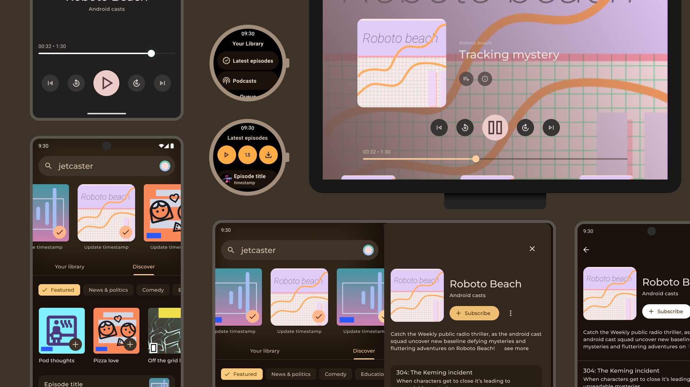

# Jetcaster sample 🎙️

Jetcaster is a sample podcast app, built with [Jetpack Compose][compose]. The goal of the sample is to
showcase building with Compose across multiple form factors (mobile, TV, and Wear) and full featured architecture.

To try out this sample app, use the latest stable version
of [Android Studio](https://developer.android.com/studio).
You can clone this repository or import the
project from Android Studio following the steps
[here](https://developer.android.com/jetpack/compose/setup#sample).

## Screenshots

</img>

## Phone app

### Features

This sample has 3 components: the home screen, the podcast details screen, and the player screen

The home screen is split into sub-screens for easy re-use:

- __Home__, allowing the user to see their subscribed podcasts (top carousel), and navigate between 'Your Library' and 'Discover'
- __Discover__, allowing the user to browse podcast categories
- __Podcast Category__, allowing the user to see a list of recent episodes for podcasts in a given category.

Multiple panes will also be shown depending on the device's [window size class][wsc].

The player screen displays media controls and the currently "playing" podcast (the sample currently **does not** actually play any media—the behavior is simply mocked).
The player screen layout is adapting to different form factors, including a tabletop layout on foldable devices:


### Others
Some other notable things which are implemented:

* Images are all provided from each podcast's RSS feed, and loaded using [Coil][coil] library.

### Architecture
The app is built in a Redux-style, where each UI 'screen' has its own [ViewModel][viewmodel], which exposes a single [StateFlow][stateflow] containing the entire view state. Each [ViewModel][viewmodel] is responsible for subscribing to any data streams required for the view, as well as exposing functions which allow the UI to send events.

Using the example of the home screen in the [`com.example.jetcaster.ui.home`](mobile/src/main/java/com/example/jetcaster/ui/home) package:

 - The ViewModel is implemented as [`HomeViewModel`][homevm], which exposes a `StateFlow<HomeViewState>` for the UI to observe.
 - [`HomeViewState`][homevm] contains the complete view state for the home screen as an [`@Immutable`](https://developer.android.com/reference/kotlin/androidx/compose/runtime/Immutable) `data class`.
 - The Home Compose UI in [`Home.kt`][homeui] uses [`HomeViewModel`][homevm], and observes it's [`HomeViewState`][homevm] as Compose [State](https://developer.android.com/reference/kotlin/androidx/compose/runtime/State), using [`collectAsStateWithLifecycle()`](https://developer.android.com/reference/kotlin/androidx/lifecycle/compose/package-summary#(kotlinx.coroutines.flow.StateFlow).collectAsStateWithLifecycle(androidx.lifecycle.LifecycleOwner,androidx.lifecycle.Lifecycle.State,kotlin.coroutines.CoroutineContext)):

``` kotlin
val viewModel: HomeViewModel = viewModel()
val viewState by viewModel.state.collectAsStateWithLifecycle()
```

This pattern is used across the different screens:

- __Home:__ [`com.example.jetcaster.ui.home`](mobile/src/main/java/com/example/jetcaster/ui/home)
- __Discover:__ [`com.example.jetcaster.ui.home.discover`](mobile/src/main/java/com/example/jetcaster/ui/home/discover)
- __Podcast Category:__ [`com.example.jetcaster.ui.category`](mobile/src/main/java/com/example/jetcaster/ui/home/category)

## Wear

This sample showcases a 2-screen pager which allows navigation between the Player and the Library.
From the Library, users can access latest episodes from subscribed podcasts, and queue.
From the podcast, users can access episode details and add episodes to the queue.
From the Player screen, users can access a volume screen and a playback speed screen.

The sample implements [Wear UX best practices for media apps][mediappsbestpractices], such as:
- Support rotating side button (RSB) and Bezel for scrollable screens
- Display scrollbar on scrolling
- Display the time on top of the screens

The sample is built using the [Media Toolkit][mediatoolkit] which is an open source
project part of [Horologist][horologist] to ease the development of media apps on Wear OS built on top of Compose for Wear.
It provides ready to use UI screens, such the [EntityScreen][entityscreen]
that is used in this sample to implement many screens such as Podcast, LatestEpisodes and Queue. [Horologist][horologist] also provides
a VolumeScreen that can be reused by media apps to conveniently control volume either by interacting with the rotating side button(RSB)/Bezel or by
using the provided buttons.
For simplicity, this sample uses a mock Player which is reused across form factors,
if you want to see an advanced Media sample built on Compose that uses Exoplayer and plays media content,
refer to the [Media Toolkit sample][mediatoolkitsample].

The [official media app guidance for Wear OS][wearmediaguidance]
recommends downloading content onto the watch before listening to preserve power, this feature will be added to this sample in future iterations. You can
refer to the [Media Toolkit sample][mediatoolkitsample] to learn how to implement the media download feature.

### Architecture
The architecture of the Wear app is similar to the phone app architecture: each UI 'screen' has its 
own [ViewModel][viewmodel] which exposes a `StateFlow<ScreenState>` for the UI to observe.

## Data

### Podcast data

The podcast data in this sample is dynamically fetched from a number of podcast RSS feeds, which are listed in [`Feeds.kt`](core/data/src/main/java/com/example/jetcaster/core/data/network/Feeds.kt).

The [`PodcastRepository`][podcastrepo] class is responsible for handling the data fetching of all podcast information:

 - Each podcast is fetched using [OkHttp][okhttp], and then parsed using [Rome][rome], within [`PodcastFetcher`][fetcher].
 - The parsed entities are then added to the local data stores: [`PodcastStore`][podcaststore], [`EpisodeStore`][epstore] &  [`CategoryStore`][catstore] for storage in the local [Room][room] [`JetcasterDatabase`][db] database.

 ### Follow podcasts

 The sample allows users to 'follow' podcasts, which is implemented within the data layer in the [`PodcastFollowedEntry`](core/data/src/main/java/com/example/jetcaster/core/data/database/model/PodcastFollowedEntry.kt) entity class, and as functions in [PodcastStore][podcaststore]: `followPodcast()`, `unfollowPodcast()`.

 ### Date + time

 The sample uses the JDK 8 [date and time APIs](https://developer.android.com/reference/java/time/package-summary) through the [desugaring support][jdk8desugar] available in Android Gradle Plugin 4.0+. Relevant Room [`TypeConverters`](https://developer.android.com/reference/kotlin/androidx/room/TypeConverters) are implemented in [`DateTimeTypeConverters.kt`](core/data/src/main/java/com/example/jetcaster/core/data/database/DateTimeTypeConverters.kt).

## License

```
Copyright 2020 The Android Open Source Project

Licensed under the Apache License, Version 2.0 (the "License");
you may not use this file except in compliance with the License.
You may obtain a copy of the License at

    https://www.apache.org/licenses/LICENSE-2.0

Unless required by applicable law or agreed to in writing, software
distributed under the License is distributed on an "AS IS" BASIS,
WITHOUT WARRANTIES OR CONDITIONS OF ANY KIND, either express or implied.
See the License for the specific language governing permissions and
limitations under the License.
```

 [feeds]: mobile/src/main/java/com/example/jetcaster/data/Feeds.kt
 [fetcher]: mobile/src/main/java/com/example/jetcaster/data/PodcastFetcher.kt
 [podcastrepo]: mobile/src/main/java/com/example/jetcaster/data/PodcastsRepository.kt
 [podcaststore]: mobile/src/main/java/com/example/jetcaster/data/PodcastStore.kt
 [epstore]: mobile/src/main/java/com/example/jetcaster/data/EpisodeStore.kt
 [catstore]: mobile/src/main/java/com/example/jetcaster/data/CategoryStore.kt
 [db]: mobile/src/main/java/com/example/jetcaster/data/room/JetcasterDatabase.kt
 [homevm]: mobile/src/main/java/com/example/jetcaster/ui/home/HomeViewModel.kt
 [homeui]: mobile/src/main/java/com/example/jetcaster/ui/home/Home.kt
 [compose]: https://developer.android.com/jetpack/compose
 [palette]: https://developer.android.com/reference/kotlin/androidx/palette/graphics/package-summary
 [room]: https://developer.android.com/topic/libraries/architecture/room
 [viewmodel]: https://developer.android.com/topic/libraries/architecture/viewmodel
 [stateflow]: https://kotlin.github.io/kotlinx.coroutines/kotlinx-coroutines-core/kotlinx.coroutines.flow/-state-flow/
 [okhttp]: https://square.github.io/okhttp/
 [rome]: https://rometools.github.io/rome/
 [jdk8desugar]: https://developer.android.com/studio/write/java8-support#library-desugaring
 [coil]: https://coil-kt.github.io/coil/
 [wsc]: https://developer.android.com/guide/topics/large-screens/support-different-screen-sizes#window_size_classes
 [mediatoolkit]: https://google.github.io/horologist/media-toolkit/
 [mediatoolkitsample]: https://google.github.io/horologist/media-sample/
 [wearmediaguidance]: https://developer.android.com/media/implement/surfaces/wear-os#play-downloaded-content
 [horologist]: https://google.github.io/horologist/
 [entityscreen]: https://github.com/google/horologist/blob/main/media/ui/src/main/java/com/google/android/horologist/media/ui/screens/entity/EntityScreen.kt
 [mediappsbestpractices]: https://developer.android.com/design/ui/wear/guides/foundations/media-apps
