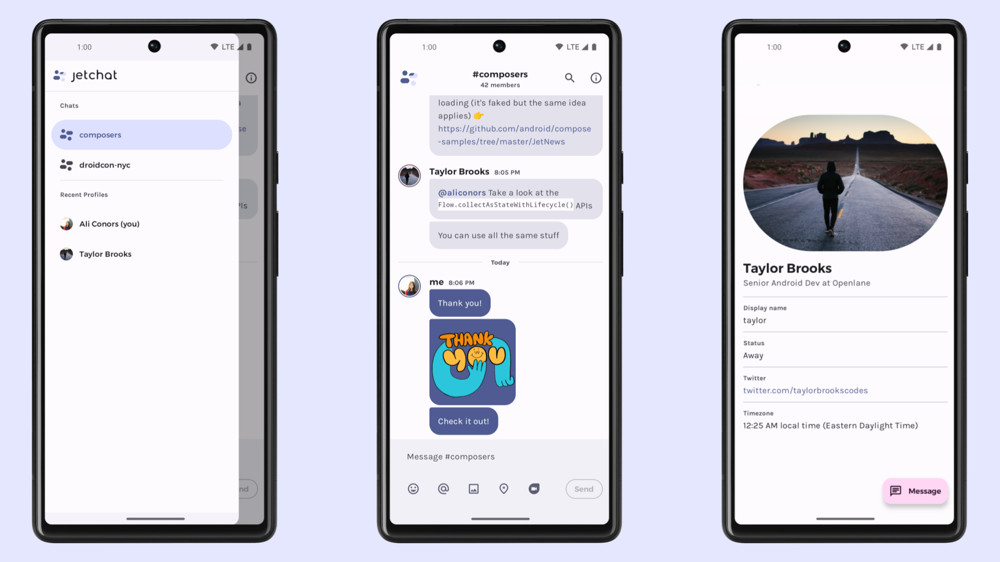

# Jetchat sample

Jetchat is a sample chat app built with [Jetpack Compose][compose].

To try out this sample app, use the latest stable version
of [Android Studio](https://developer.android.com/studio).
You can clone this repository or import the
project from Android Studio following the steps
[here](https://developer.android.com/jetpack/compose/setup#sample).

This sample showcases:

* UI state management
* Integration with Architecture Components: Navigation, Fragments, ViewModel
* Back button handling
* Text Input and focus management
* Multiple types of animations and transitions
* Saved state across configuration changes
* Material Design 3 theming and Material You dynamic color
* UI tests

## Screenshots



### Status: 🚧 In progress

Jetchat is still in under development, and some features are not yet implemented.

## Features

### UI State management
The [ConversationContent](app/src/main/java/com/example/compose/jetchat/conversation/Conversation.kt) composable is the entry point to this screen and takes a [ConversationUiState](app/src/main/java/com/example/compose/jetchat/conversation/ConversationUiState.kt) that defines the data to be displayed. This doesn't mean all the state is served from a single point: composables can have their own state too. For an example, see `scrollState` in [ConversationContent](app/src/main/java/com/example/compose/jetchat/conversation/Conversation.kt) or `currentInputSelector` in [UserInput](app/src/main/java/com/example/compose/jetchat/conversation/UserInput.kt)

### Architecture Components
The [ProfileFragment](app/src/main/java/com/example/compose/jetchat/profile/ProfileFragment.kt) shows how to pass data between fragments with the [Navigation component](https://developer.android.com/guide/navigation) and observe state from a
[ViewModel](https://developer.android.com/topic/libraries/architecture/viewmodel), served via [LiveData](https://developer.android.com/topic/libraries/architecture/livedata).

### Back button handling
When the Emoji selector is shown, pressing back in the app closes it, intercepting any navigation events. This feature shows a way to integrate Compose and APIs from the Android Framework like [OnBackPressedDispatcherOwner](https://developer.android.com/reference/androidx/activity/OnBackPressedDispatcher) via [Ambients](https://developer.android.com/reference/kotlin/androidx/compose/Ambient). The implementation can be found in [ConversationUiState](app/src/main/java/com/example/compose/jetchat/conversation/BackHandler.kt).

### Text Input and focus management
When the Emoji panel is shown the keyboard must be hidden and vice versa. This is achieved with a combination of the [FocusRequester](https://developer.android.com/reference/kotlin/androidx/compose/ui/focus/FocusRequester) and [onFocusChanged](https://developer.android.com/reference/kotlin/androidx/compose/ui/focus/package-summary#(androidx.compose.ui.Modifier).onFocusChanged(kotlin.Function1)) APIs.

### Multiple types of animations and transitions
This sample uses animations ranging from simple `AnimatedVisibility` in [FunctionalityNotAvailablePanel](app/src/main/java/com/example/compose/jetchat/conversation/UserInput.kt) to choreographed transitions found in the [FloatingActionButton](https://material.io/develop/android/components/floating-action-button) of the Profile screen and implemented in [AnimatingFabContent](app/src/main/java/com/example/compose/jetchat/conversation/UserInput.kt)

### Edge-to-edge UI with synchronized IME transitions
This sample is laid out [edge-to-edge](https://medium.com/androiddevelopers/gesture-navigation-going-edge-to-edge-812f62e4e83e), drawing its content behind the system bars for a more immersive look.

The sample also supports synchronized IME transitions when running on API 30+ devices. See the use of `Modifier.navigationBarsPadding().imePadding()` in [ConversationContent](app/src/main/java/com/example/compose/jetchat/conversation/UserInput.kt).

### Saved state across configuration changes
Some composable state survives activity or process recreation, like `currentInputSelector` in [UserInput](app/src/main/java/com/example/compose/jetchat/conversation/UserInput.kt).

### Material Design 3 theming and Material You dynamic color
Jetchat follows the [Material Design 3](https://m3.material.io) principles and uses the `MaterialTheme` composable and M3 components. On Android 12+ Jetchat supports Material You dynamic color, which extracts a custom color scheme from the device wallpaper. Jetchat uses a custom, branded color scheme as a fallback. It also implements custom typography using the Karla and Montserrat font families.

### Nested scrolling interop
Jetchat contains an example of how to use [`rememberNestedScrollInteropConnection()`](https://developer.android.com/reference/kotlin/androidx/compose/ui/platform/package-summary#rememberNestedScrollInteropConnection()) to achieve successful nested scroll interop between a View parent that implements `androidx.core.view.NestedScrollingParent3` and a Compose child. The example used here is a combination of a View parent `CoordinatorLayout` and a nested, Compose child `BoxWithConstraints` in [ProfileFragment](app/src/main/java/com/example/compose/jetchat/profile/ProfileFragment.kt). 

### UI tests
In [androidTest](app/src/androidTest/java/com/example/compose/jetchat) you'll find a suite of UI tests that showcase interesting patterns in Compose:

#### [ConversationTest](app/src/androidTest/java/com/example/compose/jetchat/ConversationTest.kt)
UI tests for the Conversation screen. Includes a test that checks the behavior of the app when dark mode changes.

#### [NavigationTest](app/src/androidTest/java/com/example/compose/jetchat/NavigationTest.kt)
Shows how to write tests that assert directly on the [Navigation Controller](https://developer.android.com/reference/androidx/navigation/NavController).

#### [UserInputTest](app/src/androidTest/java/com/example/compose/jetchat/UserInputTest.kt)
Checks that the user input composable, including extended controls, behave as expected showing and hiding the keyboard.


## Known issues
1. If the emoji selector is shown, clicking on the TextField can sometimes show both input methods.
Tracked in https://issuetracker.google.com/164859446

2. There are only two profiles, clicking on anybody except "me" will show the same data.

## License
```
Copyright 2020 The Android Open Source Project

Licensed under the Apache License, Version 2.0 (the "License");
you may not use this file except in compliance with the License.
You may obtain a copy of the License at

    https://www.apache.org/licenses/LICENSE-2.0

Unless required by applicable law or agreed to in writing, software
distributed under the License is distributed on an "AS IS" BASIS,
WITHOUT WARRANTIES OR CONDITIONS OF ANY KIND, either express or implied.
See the License for the specific language governing permissions and
limitations under the License.
```

[compose]: https://developer.android.com/jetpack/compose
[coil-accompanist]: https://google.github.io/accompanist/coil/
