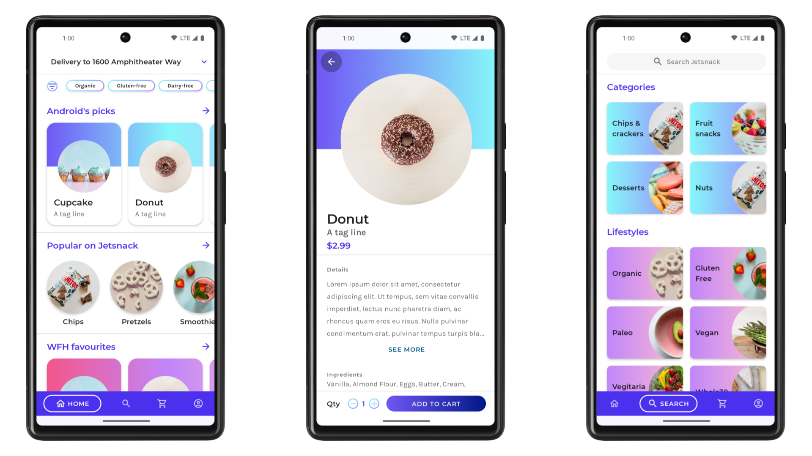
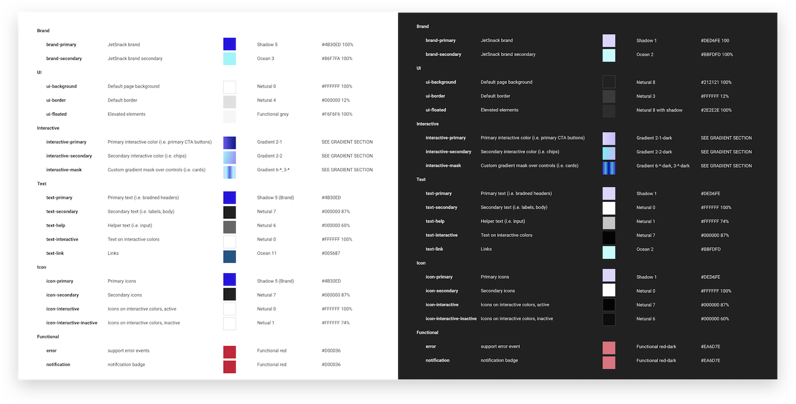

# Jetsnack sample

Jetsnack is a sample snack ordering app built with [Jetpack Compose][compose].

To try out this sample app, use the latest stable version
of [Android Studio](https://developer.android.com/studio).
You can clone this repository or import the
project from Android Studio following the steps
[here](https://developer.android.com/jetpack/compose/setup#sample).

This sample showcases:

* How to implement a custom design system
* Custom layout
* Animation

## Screenshots



### Status: 🚧 In progress 🚧

Jetsnack is still under development and some screens are not yet implemented.

## Features

### Custom Design System

Jetsnack's major feature is demonstrating how to implement a custom design system. Jetsnack has a bespoke color system and does not use [Material color theming](https://material.io/design/color/the-color-system.html).



This is implemented by:

* [`JetsnackColorPalette`](app/src/main/java/com/example/jetsnack/ui/theme/Theme.kt#L114) a class modelling the desired color system.
* [`JetsnackColorAmbient`](app/src/main/java/com/example/jetsnack/ui/theme/Theme.kt#L231) an [ambient](https://developer.android.com/reference/kotlin/androidx/compose/Ambient) holding the current color set.
* [`ProvideJetsnackColors`](app/src/main/java/com/example/jetsnack/ui/theme/Theme.kt#L222) a composable function [providing](https://developer.android.com/reference/kotlin/androidx/compose/package-summary#Providers(androidx.compose.ProvidedValue,%20kotlin.Function0)) a `JetsnackColorPalette`
* [`JetsnackTheme` object](app/src/main/java/com/example/jetsnack/ui/theme/Theme.kt#L104), providing convenient access to the current theme colors.
* [`JetsnackTheme` composable](app/src/main/java/com/example/jetsnack/ui/theme/Theme.kt#L81), the app's theme. Note that while Jetsnack implements a custom color system, it still uses Material's shape and type theming.

Jetsnack wraps Material components, customizing them to use its color system. See the [components package](app/src/main/java/com/example/jetsnack/ui/components) e.g. [`JetsnackButton`](app/src/main/java/com/example/jetsnack/ui/components/Button.kt). Jetsnack makes heavy use of gradients, see [`Gradient`](app/src/main/java/com/example/jetsnack/ui/components/Gradient.kt) for a number of helpful [`Modifier`](https://developer.android.com/reference/kotlin/androidx/compose/ui/Modifier)s.

### Custom Layout


Jetsnack utilizes custom [`Layout`](https://developer.android.com/reference/kotlin/androidx/compose/ui/package-summary#layout_1)s to achieve its design. See:

* [`CollapsingImageLayout`](app/src/main/java/com/example/jetsnack/ui/snackdetail/SnackDetail.kt#L274) shown above.
* [`SearchCategory`](app/src/main/java/com/example/jetsnack/ui/home/search/Categories.kt#L97) custom positioning of an image and text items.
* [`JetsnackBottomNavLayout`](app/src/main/java/com/example/jetsnack/ui/home/Home.kt#L170) a custom Bottom Navigation implementation which animates the width of selected/unselected items.

## Data
Domain types are modelled in the [model package](app/src/main/java/com/example/jetsnack/model), each containing static sample data exposed using fake `Repo`s objects.

Imagery is sourced from [Unsplash](https://unsplash.com/) and loaded using the [Coil][coil] library.

## Baseline Profiles
For [Baseline profiles](https://developer.android.com/topic/performance/baselineprofiles), see the [compose-latest](https://github.com/android/compose-samples/tree/compose-latest/Jetsnack) branch.

## License

```
Copyright 2020 The Android Open Source Project

Licensed under the Apache License, Version 2.0 (the "License");
you may not use this file except in compliance with the License.
You may obtain a copy of the License at

    https://www.apache.org/licenses/LICENSE-2.0

Unless required by applicable law or agreed to in writing, software
distributed under the License is distributed on an "AS IS" BASIS,
WITHOUT WARRANTIES OR CONDITIONS OF ANY KIND, either express or implied.
See the License for the specific language governing permissions and
limitations under the License.
```

[compose]: https://developer.android.com/jetpack/compose
[coil]: https://coil-kt.github.io/coil/
