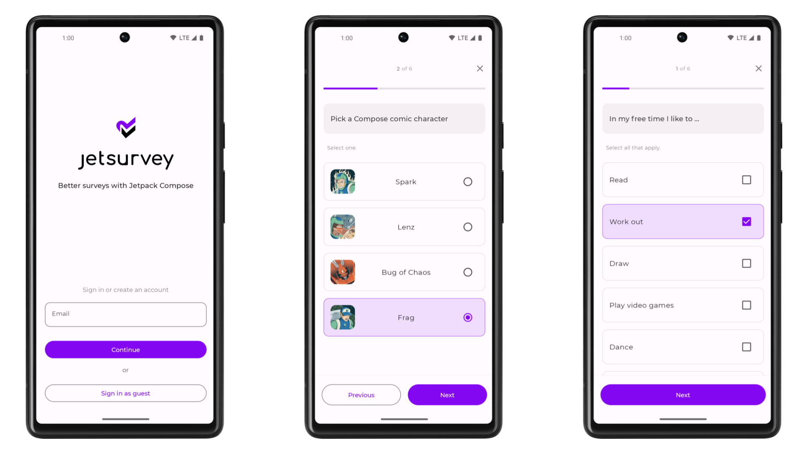

# Jetsurvey sample

Jetsurvey is a sample survey app, built with
[Jetpack Compose](https://developer.android.com/jetpack/compose). The goal of the sample is to
showcase text input, validation and state capabilities of Compose.

To try out this sample app, use the latest stable version
of [Android Studio](https://developer.android.com/studio).
You can clone this repository or import the
project from Android Studio following the steps
[here](https://developer.android.com/jetpack/compose/setup#sample).

## Screenshots



## Features

This sample contains several screens: a welcome screen, where the user can enter their email, sign in and sign up screens and a survey screen. The app has light and dark themes.

### App scaffolding

Package [`com.example.compose.jetsurvey`][1]

[`MainActivity`][2] is the application's entry point. Each screen is implemented inside a `Fragment` and [`MainActivity`][2] is the host `Activity` for all of the `Fragment`s.
The navigation between them uses the [Navigation library][3]. The screens and the navigation are defined in [`Navigation.kt`][4]

[1]: app/src/main/java/com/example/compose/jetsurvey
[2]: app/src/main/java/com/example/compose/jetsurvey/MainActivity.kt
[3]: https://developer.android.com/guide/navigation
[4]: app/src/main/java/com/example/compose/jetsurvey/Navigation.kt

### Sign in/sign up

Package [`com.example.compose.jetsurvey.signinsignup`][5]

This package contains 3 screens:
* Welcome
* Sign in
* Sign up

To get to the sign up screen, enter an email that contains "signup".
These screens show how to create different custom composable functions, reused them across multiple screens and handle UI state.

See how to:

* Use `TextField`s
* Implement `TextField` validation across one `TextField` (e.g. email validation) and across multiple `TextFields` (e.g. password confirmation)
* Use a `Snackbar`
* Use different types of `Button`s: `TextButton`, `OutlinedButton` and `Button`

[5]: app/src/main/java/com/example/compose/jetsurvey/signinsignup

### Complete a survey

Package [`com.example.compose.jetsurvey.survey`][6]

This screen allows the user to fill out a survey, showing how to handle complex state. UI state is kept and restored on recompositions triggered by different reasons like a configuration change or a new question being displayed on the screen.

See how to:

* Use `RadioButton`s - for single item selection
* Use `Checkbox`es - for multi-item selection
* Use `Slider` - for picking a value from a range
* Use `Scaffold` - for screens with top bar, bottom bar and body
* Display a `DialogFragment` when requested from compose

[6]: app/src/main/java/com/example/compose/jetsurvey/survey

### Data

The data in the sample is static, held in the `*Repository` classes.

## Setup
The main [README](https://github.com/android/compose-samples/) has instructions on how to
setup this sample, and many others.

## License

```
Copyright 2020 The Android Open Source Project

Licensed under the Apache License, Version 2.0 (the "License");
you may not use this file except in compliance with the License.
You may obtain a copy of the License at

    https://www.apache.org/licenses/LICENSE-2.0

Unless required by applicable law or agreed to in writing, software
distributed under the License is distributed on an "AS IS" BASIS,
WITHOUT WARRANTIES OR CONDITIONS OF ANY KIND, either express or implied.
See the License for the specific language governing permissions and
limitations under the License.
```
