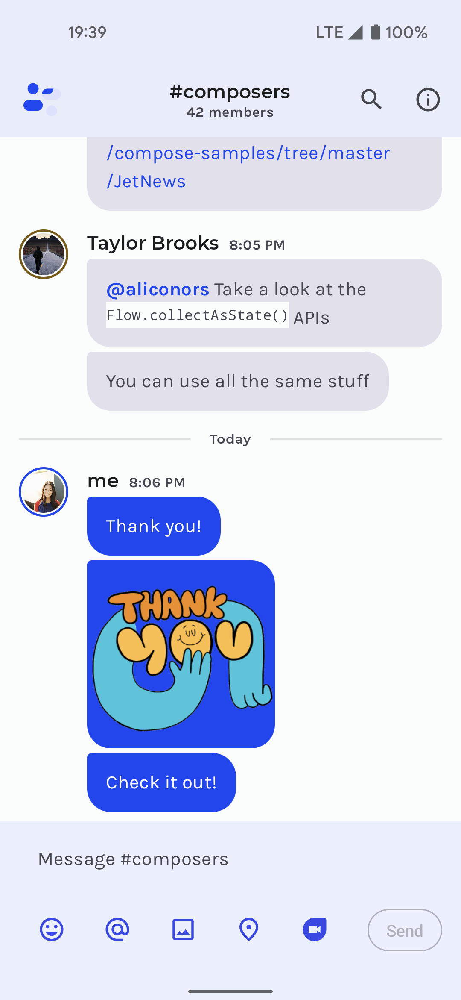

# Jetpack Compose Samples


This repository contains a set of individual Android Studio projects to help you learn about
Compose in Android. Each sample demonstrates different use cases, complexity levels and APIs.

For more information, please [read the documentation](https://developer.android.com/jetpack/compose)

💻 Requirements
------------
To try out these sample apps, you need to use the latest [Canary version of Android Studio](https://developer.android.com/studio/preview).
You can clone this repository or import the
project from Android Studio following the steps
[here](https://developer.android.com/jetpack/compose/setup#sample).

🧬 Samples
------------

| Project | |
|:-----|---------|
|  <br></img> <br><br> A sample blog post viewer that demonstrates the use of Compose with a typical Material app and real-world architecture. <br><br> • Medium complexity<br>• Varied UI<br>• Light & dark themes<br>• Resource loading<br>• UI Testing <br><br> **[> Browse](JetNews/)**<br><br> |  |
|  |  |
|  <br></img> <br><br>A sample chat app that focuses on UI state patterns and text input.<br><br>• Low complexity<br>• Simple Material Design theme (Light & dark)<br>• Resource loading<br>• Back button handling<br>• Integration with Architecture Components: Navigation, Fragments, LiveData, ViewModel<br>• Animation<br>• UI Testing<br><br>**[> Browse](Jetchat/)** <br><br> | |
|  |  |
| <br></img> <br><br>A sample survey app that showcases text input, validation and UI state management in Compose.<br><br>• Low complexity<br>• `TextField` and form validation<br>• Snackbar implementation<br>• Element reusability and styling<br>• Various form elements<br><br><br>**[> Browse](Jetsurvey/)** <br><br> |  |
|  |  |
| <br></img> <br><br>Jetsnack is a sample snack ordering app built with Compose.<br><br>• Medium complexity<br>• Custom design system<br>• Custom layouts<br>• Animation<br><br>**[> Browse](Jetsnack/)** <br><br>  | |
|  |  |
| <br></img> <br><br>A sample podcast app that features a full-featured, Redux-style architecture and showcases dynamic themes.<br><br>• Advanced sample<br>• Dynamic theming using podcast artwork<br>• Image fetching<br>• [`WindowInsets`](https://developer.android.com/reference/kotlin/android/view/WindowInsets) support<br>• Coroutines<br>• Local storage with Room<br><br>**[> Browse](Jetcaster/)** <br><br>  | |
|  |  |
| <br></img>  <br><br>A Compose implementation of the Rally Material study, a financial app that focuses on data, charts, reusability and animations.<br><br>• Low complexity<br>• Material theming with a dark-only theme<br>• Custom layouts and reusable elements<br>• Charts and tables<br>• Animations<br>• Screenshot tests<br><br>**[> Browse](Rally/)** <br><br>  | |
|  |  |
| <br></img>  <br><br>A Compose implementation of the Crane Material study, a travel app that uses Material Design components and Material Theming to create a personalized, on-brand experience.<br><br>• Medium complexity<br>• Draggable UI elements<br>• Android Views inside Compose<br>• UI state handling<br>• UI Tests<br><br>**[> Browse](Crane/)** <br><br>  | |
|  |  |
| <br></img>  <br><br>A Compose implementation of the Owl Material study. The Owl brand uses bold color, shape, and typography to express its brand attributes: energy, daring, and fun.<br><br>• Medium complexity<br>• Material theming & light/dark themes<br>• Custom layout<br>• Animation<br><br>**[> Browse](Owl/)** <br><br>  | |

🧬 Compose in existing app samples
------------

To see how Compose and view-based UIs can coexist and interact together, check out these samples:
* [Sunflower's `compose` branch](https://goo.gle/sunflower-compose)
* [Tivi](https://tivi.app)

## License
```
Copyright 2020 The Android Open Source Project

Licensed under the Apache License, Version 2.0 (the "License");
you may not use this file except in compliance with the License.
You may obtain a copy of the License at

    https://www.apache.org/licenses/LICENSE-2.0

Unless required by applicable law or agreed to in writing, software
distributed under the License is distributed on an "AS IS" BASIS,
WITHOUT WARRANTIES OR CONDITIONS OF ANY KIND, either express or implied.
See the License for the specific language governing permissions and
limitations under the License.
```
