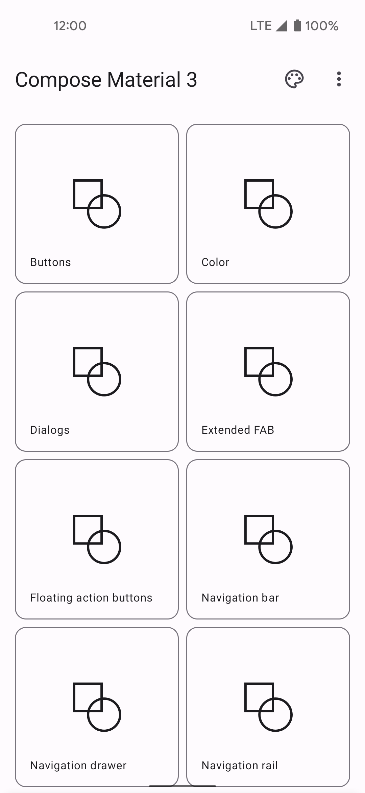

# Jetpack Compose Samples


This repository contains a set of individual Android Studio projects to help you learn about
Compose in Android. Each sample demonstrates different use cases, complexity levels and APIs.

For more information, please [read the documentation](https://developer.android.com/jetpack/compose).

💻 Requirements
------------
To try out these sample apps, you need to use [Android Studio](https://developer.android.com/studio).
You can clone this repository or import the
project from Android Studio following the steps
[here](https://developer.android.com/jetpack/compose/setup#sample).

🧬 Samples
------------

| Project | |
|:-----|---------|
|  <br></img> <br><br> A sample blog post viewer that demonstrates the use of Compose with a typical Material app and real-world architecture. <br><br> • Medium complexity<br>• Varied UI<br>• Light & dark themes<br>• Resource loading<br>• UI Testing <br><br> **[> Browse](JetNews/)**<br><br> |  |
|  |  |
|  <br></img> <br><br>A sample chat app that focuses on UI state patterns and text input.<br><br>• Low complexity<br>• Material Design 3 theme and Material You dynamic color<br>• Resource loading<br>• Back button handling<br>• Integration with Architecture Components: Navigation, Fragments, LiveData, ViewModel<br>• Animation<br>• UI Testing<br><br>**[> Browse](Jetchat/)** <br><br> | |
|  |  |
| <br></img> <br><br>Jetsnack is a sample snack ordering app built with Compose.<br><br>• Medium complexity<br>• Custom design system<br>• Custom layouts<br>• Animation<br><br>**[> Browse](Jetsnack/)** <br><br>  | |
|  |  |
| <br></img> <br><br>A sample podcast app that features a full-featured, Redux-style architecture and showcases dynamic themes.<br><br>• Advanced sample<br>• Dynamic theming using podcast artwork<br>• Image fetching<br>• [`WindowInsets`](https://developer.android.com/reference/kotlin/android/view/WindowInsets) support<br>• Coroutines<br>• Local storage with Room<br><br>**[> Browse](Jetcaster/)** <br><br>  | |
|  |  |
| <br></img>  <br><br>A compose implementation of the Reply material study, an email client app that focuses on adaptive design for mobile, tablets and foldables. It also showcases brand new Material design 3 theming, dynamic colors and navigation components.<br><br>• Medium complexity<br>• Adaptive UI for phones, tablet and desktops<br>• Foldable support<br>• Material 3 theming & Components<br>• Dynamic colors and Light/Dark theme support<br><br>**[> Browse](Reply/)** <br><br>  | |
|  |  |
| <br></img>  <br><br>A sample sleep tracker app, showcasing how to create custom layouts and graphics in Compose<br><br>• Custom Layouts<br>• Graphs with Paths<br><br>**[> Browse](JetLagged/)** <br><br>  | |

🧬 Additional samples
------------

| Project | |
|:-----|---------|
| <br></img>  <br><br>An app for keeping up to date with the latest news and developments in Android.<br><br>• [Jetpack Compose](https://developer.android.com/jetpack/compose) first app.<br>• Implements the recommended Android [Architecture Guidelines](https://developer.android.com/topic/architecture) <br>• Integrates [Jetpack Libraries](https://developer.android.com/jetpack) holistically in the context of a real world app<br><br><a href="https://play.google.com/store/apps/details?id=com.google.samples.apps.nowinandroid"></a><br>**[> Browse](https://github.com/android/nowinandroid)** <br><br>  | |
|  |  |
| <br></img>  <br><br>A catalog of Material Design components and features available in Jetpack Compose. See how to implement them and how they look and behave on real devices.<br><br>• Lives in AOSP—always up to date<br>• Uses the same samples as API reference docs<br>• Theme picker to change Material Theming values at runtime<br>• Links to guidelines, docs, source code, and issue tracker<br><br><a href="https://play.google.com/store/apps/details?id=androidx.compose.material.catalog"></a><br>**[> Browse on AOSP](https://cs.android.com/androidx/platform/frameworks/support/+/androidx-main:compose/integration-tests/material-catalog)** <br><br>  | |


## High level features 

Looking for a sample that has the following features?

### Custom Layouts
* [Jetnews: Interests Screen](https://github.com/android/compose-samples/blob/ee198110d8a7575da281de9bd0f84e91970468ca/JetNews/app/src/main/java/com/example/jetnews/ui/interests/InterestsScreen.kt#L428)
* [Jetchat: AnimatedFabContent](https://github.com/android/compose-samples/blob/ee198110d8a7575da281de9bd0f84e91970468ca/Jetchat/app/src/main/java/com/example/compose/jetchat/components/AnimatingFabContent.kt#L101)
* [Jetsnack: Grid](https://github.com/android/compose-samples/blob/73d7f25815e6936e0e815ce975905a6f10744c36/Jetsnack/app/src/main/java/com/example/jetsnack/ui/components/Grid.kt#L27)
* [Jetsnack: CollapsingImageLayout](https://github.com/android/compose-samples/blob/main/Jetsnack/app/src/main/java/com/example/jetsnack/ui/snackdetail/SnackDetail.kt)

### Theming
* [Jetchat: Material3](https://github.com/android/compose-samples/blob/main/Jetchat/app/src/main/java/com/example/compose/jetchat/theme/Themes.kt#L91)
* [Jetcaster: Custom theme based on cover art](https://github.com/android/compose-samples/blob/main/Jetcaster/app/src/main/java/com/example/jetcaster/util/DynamicTheming.kt)
* [Jetsnack: Custom Design System](https://github.com/android/compose-samples/blob/main/Jetsnack/app/src/main/java/com/example/jetsnack/ui/theme/Theme.kt)

### Animations
* [Jetsurvey: AnimatedContent](https://github.com/android/compose-samples/pull/842)
* [Jetcaster: Animated theme colors](https://github.com/android/compose-samples/blob/69e9d862b5ffb321064364d7883e859db6daeccd/Jetcaster/app/src/main/java/com/example/jetcaster/util/DynamicTheming.kt)
* [Jetsnack: Animating Bottom Barl](https://github.com/android/compose-samples/blob/main/Jetsnack/app/src/main/java/com/example/jetsnack/ui/home/Home.kt)

### Text
* [Jetchat: Downloadable Fonts](https://github.com/android/compose-samples/pull/787)

### Large Screens
* [Jetcaster - Supporting Pane](https://github.com/android/compose-samples/blob/3dbbf0912b57dacefcfb79191a2d7d6b053dadb8/Jetcaster/app/src/main/java/com/example/jetcaster/ui/home/Home.kt#L282)
* [Jetnews - Window Size Classes](https://github.com/android/compose-samples/blob/69e9d862b5ffb321064364d7883e859db6daeccd/JetNews/app/src/main/java/com/example/jetnews/ui/MainActivity.kt#L36)

### TV
* [Jetcaster - TV](https://github.com/android/compose-samples/tree/3dbbf0912b57dacefcfb79191a2d7d6b053dadb8/Jetcaster/tv-app)

### Wear
* [Jetcaster - Wear](https://github.com/android/compose-samples/tree/3dbbf0912b57dacefcfb79191a2d7d6b053dadb8/Jetcaster/wear)

## Formatting

To automatically format all samples: Run `./scripts/format.sh`
To check one sample for errors: Navigate to the sample folder and run `./gradlew spotlessCheck`
To format one sample: Navigate to the sample folder and run `./gradlew spotlessApply`

## Updates

To update dependencies to their new stable versions, run:

```
./scripts/updateDeps.sh
```

Any other version updates need to be made individually.

## Obsolete Sample Projects

Over time some of our samples become a little stale and are removed to keep the
repository easy to navigate. If you are curious you can still find them in the 
history, however if you are new you might be better served sticking to
the most up to date resources.

| Project                                          | Removed    | Commit                                                              |
| ------------------------------------------------ | -----------|-------------------------------------------------------------------- |
| [Crane](../../tree/v2024.05.00/Crane)         | 2024-08-02 | [ee8e272](../../commit/ee8e27289f4bc36304ee9f04397f49c35f402a65) |
| [Owl](../../tree/v2024.05.00/Owl)             | 2024-08-02 | [ee8e272](../../commit/ee8e27289f4bc36304ee9f04397f49c35f402a65) |
| [Jetsurvey](../../tree/v2024.05.00/Jetsurvey) | 2024-08-02 | [ee8e272](../../commit/ee8e27289f4bc36304ee9f04397f49c35f402a65) |
| [Rally](../../tree/v2024.05.00/Rally)         | 2024-08-02 | [ee8e272](../../commit/ee8e27289f4bc36304ee9f04397f49c35f402a65) |

## License
```
Copyright 2024 The Android Open Source Project

Licensed under the Apache License, Version 2.0 (the "License");
you may not use this file except in compliance with the License.
You may obtain a copy of the License at

    https://www.apache.org/licenses/LICENSE-2.0

Unless required by applicable law or agreed to in writing, software
distributed under the License is distributed on an "AS IS" BASIS,
WITHOUT WARRANTIES OR CONDITIONS OF ANY KIND, either express or implied.
See the License for the specific language governing permissions and
limitations under the License.
```
