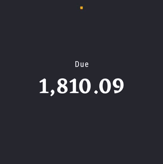

# Rally sample

This sample is a [Jetpack Compose][compose] implementation of [Rally][rally], a Material Design study.

To try out these sample apps, you need to use the latest Canary version of Android Studio 4.2.
You can clone this repository or import the
project from Android Studio following the steps
[here](https://developer.android.com/jetpack/compose/setup#sample).

This sample showcases:

* [Material theming][materialtheming]
* Custom layouts and reusable elements
* Charts and tables
* Animations


### Status: 🚧 In progress

This sample is still in under development, and some features are not yet implemented.

## Features

### Purpose
This sample is a simple introduction to Material Design in Compose and it focuses on creating custom layouts and reusable elements. It uses a very simple architecture with a single activity and some hard-coded sample data. The navigation mechanism is implemented as a placeholder for an eventual official implementation using [Android Architecture Components Navigation](https://developer.android.com/guide/navigation).

### Custom layouts and reusable elements
Rally contains screens that have very similar elements, which allows for reusing a lot of code and implementing composables that are "styled" programmatically as needed.

For example, [AccountsScreen](app/src/main/java/com/example/compose/rally/ui/accounts/AccountsScreen.kt) and [BillsScreen](app/src/main/java/com/example/compose/rally/ui/bills/BillsScreen.kt) wrap the same [`StatementBody`](app/src/main/java/com/example/compose/rally/ui/components/DetailsScreen.kt) composable which takes a list of _items_, their colors, amounts and even a slot to compose the item itself. Instead of passing lists with all this meta information, it's much more convenient, reusable and performant to pass functions and delegate how to fetch this information to each caller, making `StatementBody` completely generic:

```kotlin
@Composable
fun <T> StatementBody(
    items: List<T>,
    colors: (T) -> Color,
    amounts: (T) -> Float,
    rows: @Composable (T) -> Unit
    ...
```

```kotlin
@Composable
fun AccountsBody(accounts: List<Account>) {
    StatementBody(
        items = accounts,
        colors = { account -> account.color },
        amounts = { account -> account.balance },
        rows = { account -> AccountRow(...) }
        ...
```

### Theming
Rally follows [Material Design][materialtheming], customizing [colors](app/src/main/java/com/example/compose/rally/ui/theme/Color.kt) and [typography](app/src/main/java/com/example/compose/rally/ui/theme/RallyTheme.kt) used in the app via the [RallyTheme](app/src/main/java/com/example/compose/rally/ui/theme/RallyTheme.kt). Rally's design only contains a dark theme, therefore the theme does not contain any light colors.

### Charts and animations
This sample features a donut chart that combines drawing using [`Canvas`](https://developer.android.com/reference/kotlin/androidx/compose/ui/graphics/Canvas) with animations combining two animated parameters: `AngleOffset` and `Shift`. This creates the animation with minimum boilerplate:

```kotlin
private enum class AnimatedCircleProgress { START, END }

private val CircularTransition = transitionDefinition<AnimatedCircleProgress> {
    state(AnimatedCircleProgress.START) {
        this[AngleOffset] = 0f
        this[Shift] = 0f
    }
    state(AnimatedCircleProgress.END) {
        this[AngleOffset] = 360f
        this[Shift] = 30f
    }
    transition(fromState = AnimatedCircleProgress.START, toState = AnimatedCircleProgress.END) {
        AngleOffset using tween(
            delayMillis = 500,
            durationMillis = 900,
            easing = CubicBezierEasing(0f, 0.75f, 0.35f, 0.85f)
        )
        Shift using tween(
            delayMillis = 500,
            durationMillis = 900,
            easing = LinearOutSlowInEasing
        )
    }
}
```



## License
```
Copyright 2020 The Android Open Source Project

Licensed under the Apache License, Version 2.0 (the "License");
you may not use this file except in compliance with the License.
You may obtain a copy of the License at

    https://www.apache.org/licenses/LICENSE-2.0

Unless required by applicable law or agreed to in writing, software
distributed under the License is distributed on an "AS IS" BASIS,
WITHOUT WARRANTIES OR CONDITIONS OF ANY KIND, either express or implied.
See the License for the specific language governing permissions and
limitations under the License.
```

[compose]: https://developer.android.com/jetpack/compose
[rally]: https://material.io/design/material-studies/rally.html
[materialtheming]: https://material.io/design/material-theming/overview.html#material-theming
