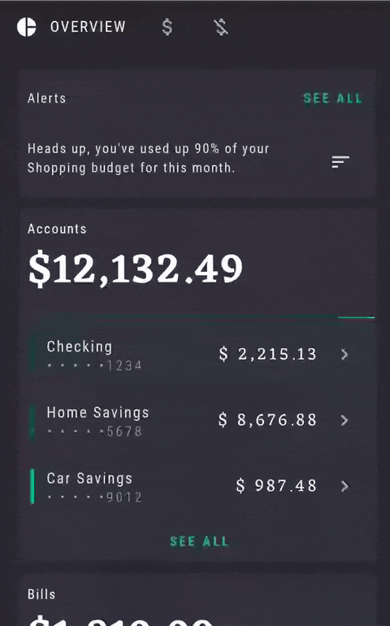

# Rally sample

This sample is a [Jetpack Compose][compose] implementation of [Rally][rally], a Material Design study.

Rally is used as the starting point in the following codelabs:

 - [Jetpack Compose Navigation codelab][navcodelab] (**[code][navcodelabcode]**): Learn how to use the Jetpack Navigation library in Compose, navigate within your application, navigate with arguments, support deep-links, and test your navigation.
 - [Jetpack Compose Testing codelab][testcodelab] (**[code][testcodelabcode]**):: Learn about testing Jetpack Compose UIs. Write your first tests, and learn about testing in isolation, debugging tests, the semantics tree, and test synchronization.




## License
```
Copyright 2021 The Android Open Source Project

Licensed under the Apache License, Version 2.0 (the "License");
you may not use this file except in compliance with the License.
You may obtain a copy of the License at

    https://www.apache.org/licenses/LICENSE-2.0

Unless required by applicable law or agreed to in writing, software
distributed under the License is distributed on an "AS IS" BASIS,
WITHOUT WARRANTIES OR CONDITIONS OF ANY KIND, either express or implied.
See the License for the specific language governing permissions and
limitations under the License.
```

[compose]: https://developer.android.com/jetpack/compose
[rally]: https://material.io/design/material-studies/rally.html
[navcodelab]: https://developer.android.com/codelabs/jetpack-compose-navigation
[navcodelabcode]: https://github.com/googlecodelabs/android-compose-codelabs/tree/main/NavigationCodelab
[testcodelab]: https://developer.android.com/codelabs/jetpack-compose-testing
[testcodelabcode]: https://github.com/googlecodelabs/android-compose-codelabs/tree/main/TestingCodelab
