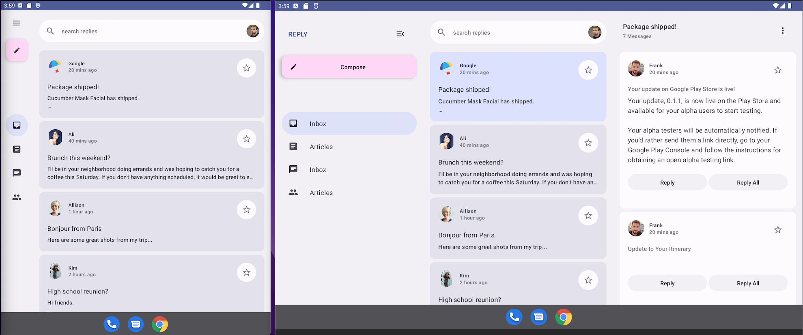
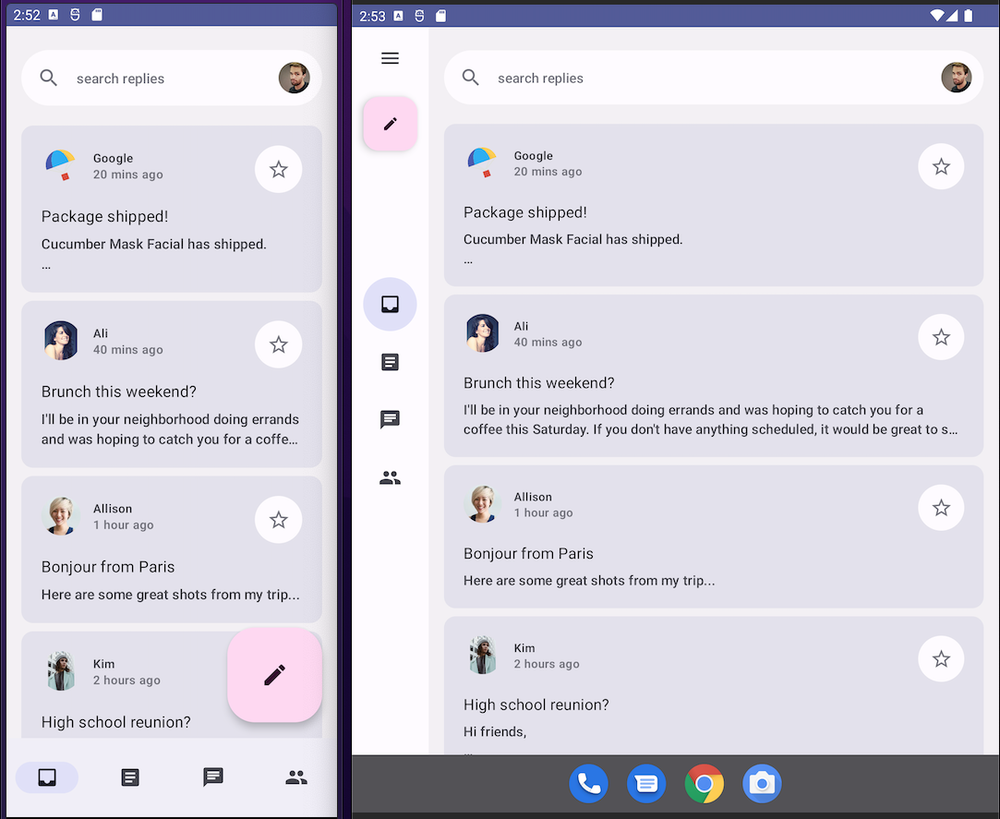
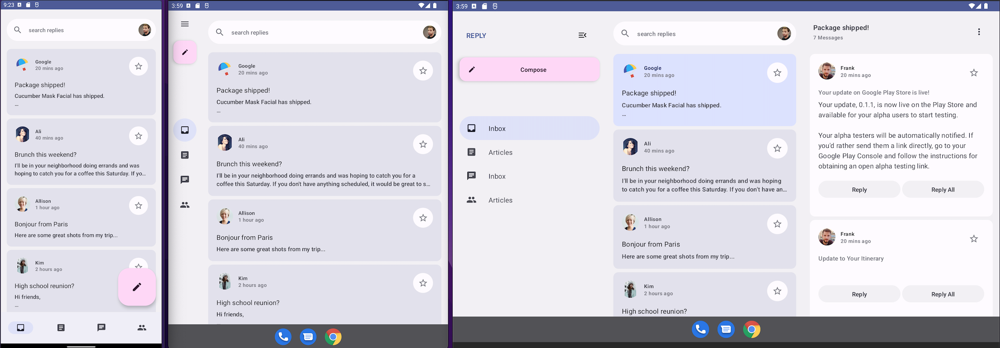
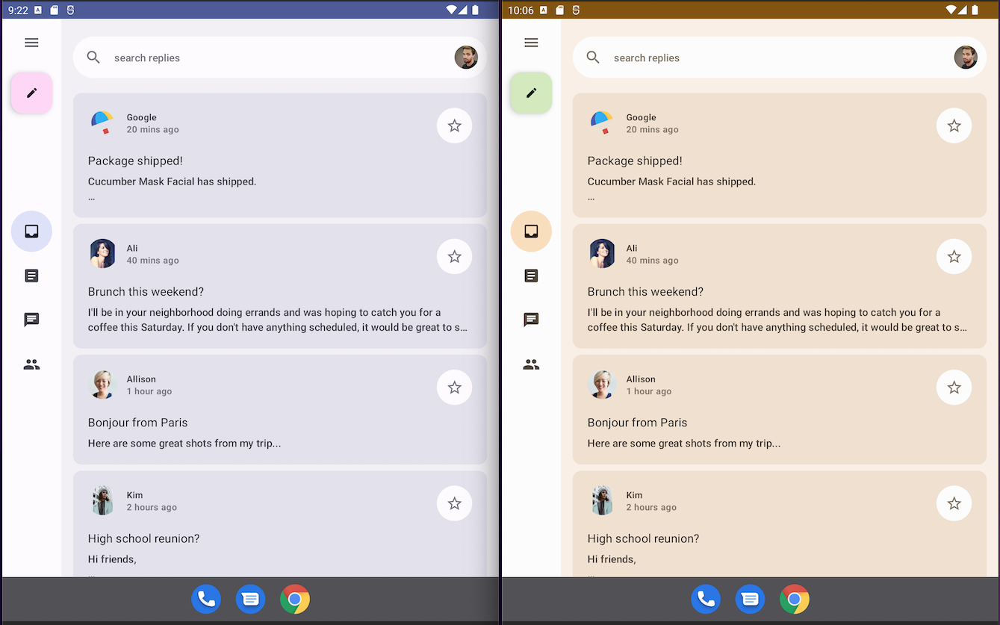

# Reply sample

This sample is a [Jetpack Compose][compose] implementation of [Reply][reply], a material design study for adaptive design.

To try out this sample app, use the latest stable version
of [Android Studio](https://developer.android.com/studio).
[Resizeable Emulator](https://developer.android.com/about/versions/12/12L/get#resizable-emulator)
You can clone this repository or import the
project from Android Studio following the steps
[here](https://developer.android.com/jetpack/compose/setup#sample).

This sample showcases:

* Adaptive apps for mobile, tablets and foldables 
* Material navigation components
* [Material 3 theming][materialtheming] & dynamic colors.

## Design & Screenshots




## Features

#### [Dynamic window resizing](app/src/main/java/com/example/reply/ui/ReplyApp.kt#74)
The [WindowSizeClass](https://developer.android.com/reference/kotlin/androidx/compose/material3/windowsizeclass/WindowSizeClass) allows us to get to know about current device size and configuration 
and observe any changes in device size in case of orientation change or unfolding of device.


#### [Dynamic fold detection](app/src/main/java/com/example/reply/ui/MainActivity.kt#56)
The [WindowLayoutInfo](https://developer.android.com/reference/kotlin/androidx/window/layout/WindowLayoutInfo) let us observe all display features including [Folding Postures](app/src/main/java/com/example/reply/ui/utils/WindowStateUtils.kt)
real-time whenever fold state changes to help us adjust our UI accordingly.




#### [Material 3 navigation components](app/src/main/java/com/example/reply/ui/navigation/ReplyNavigationComponents.kt)
The sample provides usage of  material navigation components depending on screen size and states. These components also are part of material guidelines for canonical layouts to improve user experience and ergonomics.
* [`BottomNavigationBar`](app/src/main/java/com/example/reply/ui/navigation/ReplyNavigationComponents.kt#162) is used for compact devices with maximum of 5 navigation destinations. 
* [`NavigationRail`](app/src/main/java/com/example/reply/ui/navigation/ReplyNavigationComponents.kt#70) is used for medium size devices. It is also used along with [`ModalNavigationDrawer`](app/src/main/java/com/example/reply/ui/ReplyApp.kt#73) when user want to see more content.
* [`PermanentNavigationDrawer`](app/src/main/java/com/example/reply/ui/ReplyApp.kt#153) is used for large devices or desktops when we have enough space to show navigation drawer content always.
* Depending upon the different size and state of device correct [navigation type](app/src/main/java/com/example/reply/ui/ReplyApp.kt#71) is chosen dynamically.





#### [Material 3 Theming](app/src/main/java/com/example/reply/ui/theme)
Reply is using brand new Material 3 [colors](app/src/main/java/com/example/reply/ui/theme/Color.kt), [typography](app/src/main/java/com/example/reoly/ui/theme/Type.kt) and [theming](app/src/main/java/com/example/reply/ui/theme/Theme.kt). It also supports both [light and dark mode]((app/src/main/java/com/example/reply/ui/theme/Theme.kt#95)) depending on system settings.
[Material Theme builder](https://material-foundation.github.io/material-theme-builder/#/custom) is used to create material 3 theme and directly export it for Compose.

#### [Dynamic theming/Material You](app/src/main/java/com/example/reply/ui/theme/Theme.kt#100)
On Android 12+ Reply supports Material You dynamic color, which extracts a custom color scheme from the device wallpaper. For older version of android it falls back to defined light and dark [color schemes](app/src/main/java/com/example/reply/ui/theme/Theme.kt#L34)





#### [Inbox Screen](app/src/main/java/com/example/reply/ui/ReplyListContent.kt)
Similar to navigation type, depending on device's size and state correct [content type](app/src/main/java/com/example/reply/ui/ReplyApp.kt#72) is chosen, we can have [Inbox only](app/src/main/java/com/example/reply/ui/ReplyListContent.kt#91) or [Inbox and thread detail](app/src/main/java/com/example/reply/ui/ReplyListContent.kt#83) together. The content in inbox screen
is adaptive and is switched between list only or list and detail page depending on the screen size available.


#### [FAB & Material 3 components](app/src/main/java/com/example/reply/ui/ReplyListContent.kt)
Reply is using all material 3 components including different type of FAB for different screen size and states.
* [`LargeFloatingActionButton`](app/src/main/java/com/example/reply/ui/ReplyListContent.kt#100) is used along with bottom navigation ber.
* [`FloatingActionButton`](app/src/main/java/com/example/reply/ui/navigation/ReplyNavigationComponents.kt#87) is used with Navigation rail for medium to large tablets.
* [`ExtendedFloatingActionButton`](app/src/main/java/com/example/reply/ui/navigation/ReplyNavigationComponents.kt#214) is used in Navigation drawer for large devices.

#### [Data](app/src/main/java/com/example/reply/data)
Reply has static local data providers for [email](app/src/main/java/com/example/reply/data/local/LocalEmailsDataProvider.kt) and [account](app/src/main/java/com/example/reply/data/local/LocalAccountsDataProvider.kt) data. It is also using repository pattern where [EmailRepository](app/src/main/java/com/example/reply/data/EmailsRepository.kt) 
emits the flow of email from local data that is used in [ReplyHomeViewModel](app/src/main/java/com/example/reply/ui/ReplyHomeViewModel.kt) to observe 
it in view model scope. The `ViewModel` exposes this data to ReplyApp composable via [state flow](app/src/main/java/com/example/reply/ui/ReplyHomeViewModel.kt#34).

## License
```
Copyright 2022 The Android Open Source Project

Licensed under the Apache License, Version 2.0 (the "License");
you may not use this file except in compliance with the License.
You may obtain a copy of the License at

    https://www.apache.org/licenses/LICENSE-2.0

Unless required by applicable law or agreed to in writing, software
distributed under the License is distributed on an "AS IS" BASIS,
WITHOUT WARRANTIES OR CONDITIONS OF ANY KIND, either express or implied.
See the License for the specific language governing permissions and
limitations under the License.
```

[compose]: https://developer.android.com/jetpack/compose
[reply]: https://m3.material.io/foundations/adaptive-design/overview
[materialtheming]: https://m3.material.io/styles/color/dynamic-color/overview
